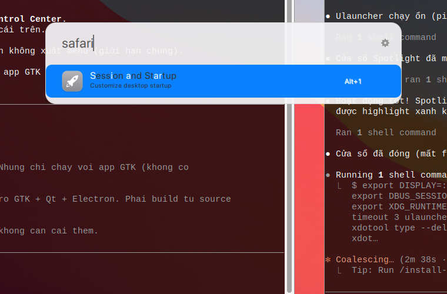
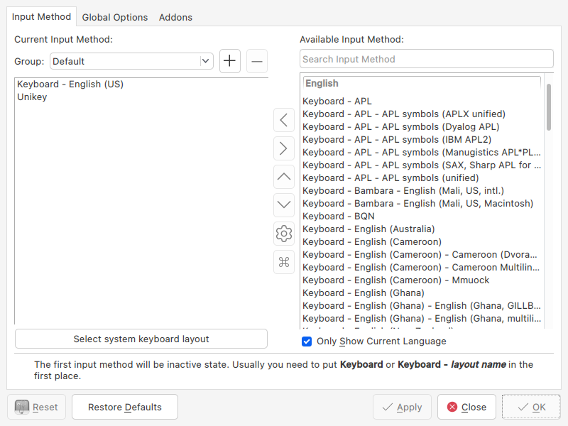

# macOS WhiteSur Look for Debian 13 / XFCE

> 🇻🇳 Biến Debian 13 (XFCE trên X11) trông giống macOS Big Sur với theme WhiteSur, dock Plank, thanh menu trên cùng và đèn giao thông bên trái.
>
> 🇬🇧 Make Debian 13 (XFCE on X11) look like macOS Big Sur using the WhiteSur theme, a Plank dock, a top menu bar, and left-side traffic-light buttons.

---

## 🧩 Nó làm gì / What it does

**🇻🇳** Bộ cài này thay đổi toàn bộ giao diện desktop để mô phỏng macOS. Bảng dưới đây liệt kê từng thành phần được thay đổi.

**🇬🇧** This setup changes the whole desktop look to mimic macOS. The table below lists every component it modifies.

| Thành phần / Component | Thay đổi / Change |
| --- | --- |
| **GTK theme** | WhiteSur-Light (cửa sổ, menu, widget theo phong cách macOS / macOS-style windows, menus, widgets) |
| **xfwm4 titlebars** | Viền cửa sổ WhiteSur + nút "đèn giao thông" (đỏ/vàng/xanh) ở **bên trái** / WhiteSur window borders with left-aligned red/yellow/green traffic-light buttons |
| **Icons** | WhiteSur icon theme (biểu tượng ứng dụng & thư mục kiểu macOS / macOS-style app & folder icons) |
| **Cursor** | WhiteSur-cursors (con trỏ kiểu macOS / macOS-style pointer) |
| **Fonts** | SF Pro Display / SF Pro Text (phông chữ hệ thống của Apple / Apple's system fonts) |
| **Wallpaper** | Hình nền Big Sur (tự dò màn hình / Big Sur wallpaper, monitors auto-detected) |
| **Plank dock** | Dock dưới cùng với **Finder** + **Thùng rác (Trash)**, theme WhiteSur-Light / bottom dock with Finder + Trash, WhiteSur-Light theme |
| **Top menu bar** | Thanh trên cùng (panel-1) có **logo Apple**, âm lượng, pin, khay hệ thống và đồng hồ / top panel with Apple logo, volume, battery, system tray and clock |
| **Conky** | Tắt (disabled) để tránh trùng với giao diện macOS / disabled to avoid clashing with the macOS look |
| **Spotlight** | Ulauncher + theme `spotlight`, mở bằng `Super+Space` (cài riêng qua `install-spotlight.sh`) / Ulauncher + the `spotlight` theme, opens with `Super+Space` (installed separately via `install-spotlight.sh`) |
| **Bộ gõ tiếng Việt / Vietnamese input** | fcitx5-unikey (Telex), bật/tắt bằng `Ctrl+Space` (cài riêng qua `install-vietnamese.sh`) / fcitx5-unikey (Telex), toggle with `Ctrl+Space` (installed separately via `install-vietnamese.sh`) |
| **Bộ Office / Office suite** | ONLYOFFICE (ribbon giống MS Office) + font Microsoft + icon Office kiểu macOS, ghim sẵn vào dock (cài riêng qua `install-office.sh`) / ONLYOFFICE (MS Office-like ribbon) + Microsoft fonts + a macOS-style Office icon, pinned to the dock (installed separately via `install-office.sh`) |

---

## ✅ Yêu cầu / Requirements

**🇻🇳**
- Debian 13 chạy **XFCE trên X11** (không phải Wayland).
- Quyền `sudo` (để `apt` cài gói: Plank, phông chữ, công cụ theme).
- Chạy script **bên trong phiên đăng nhập XFCE** của bạn (cần `DISPLAY`).

**🇬🇧**
- Debian 13 running **XFCE on X11** (not Wayland).
- `sudo` access (so `apt` can install packages: Plank, fonts, theme tools).
- Run the scripts **from inside your XFCE login session** (needs `DISPLAY`).

---

## 🚀 Bắt đầu nhanh / Quick start

**🇻🇳** Mở Terminal và chạy:

**🇬🇧** Open a Terminal and run:

```bash
cd ~/Desktop/macos-theme-setup
chmod +x *.sh
./install.sh
```

**🇻🇳** Muốn bật cả **global menu** (menu ứng dụng dồn lên thanh trên cùng như macOS), dùng:

**🇬🇧** To also enable the **global menu** (app menus moved up to the top bar like macOS), use:

```bash
./install.sh --with-global-menu
```

---

## 🔍 Spotlight (tìm kiếm kiểu macOS) / macOS-style Spotlight search



**🇻🇳**
XFCE không có Spotlight sẵn, nên bộ cài này dùng **[Ulauncher](https://ulauncher.io/)** và áp một theme tự làm (`spotlight`) để trông giống hệt Spotlight của macOS: ô tìm kiếm bo góc, nền mờ trong suốt, phông **SF Pro**, dòng kết quả được highlight màu xanh. Phím mở là **`Super + Space`** (phím Windows/Cmd + Space — giống `Cmd+Space` của macOS).

> ℹ️ Mặc định Ulauncher dùng `Ctrl+Space`, nhưng nếu bạn cài thêm bộ gõ tiếng Việt (xem bên dưới) thì phím đó dành cho bật/tắt tiếng Việt. `install-vietnamese.sh` sẽ tự dời Spotlight sang `Super+Space`.

```bash
cd ~/Desktop/macos-theme-setup
./install-spotlight.sh
```

> ⚠️ Ulauncher **không có** trong kho apt của Debian 13, nên script tải gói `.deb` chính thức (5.15.15) từ GitHub. Bước cài `.deb` cần `sudo`.

**Cách dùng:** nhấn **`Super + Space`** → gõ tên ứng dụng / phép tính / tệp → `Enter` để mở, `Esc` để đóng. Ulauncher tự khởi động cùng phiên đăng nhập (đã thêm vào `~/.config/autostart`).

**🇬🇧**
XFCE has no built-in Spotlight, so this setup uses **[Ulauncher](https://ulauncher.io/)** with a custom `spotlight` theme that mimics macOS Spotlight: a rounded, translucent search box, the **SF Pro** font, and a blue-highlighted result row. The open shortcut is **`Super + Space`** (the Windows/Cmd key + Space — like macOS `Cmd+Space`).

> ℹ️ Ulauncher defaults to `Ctrl+Space`, but if you also install the Vietnamese input method (below) that combo toggles Vietnamese. `install-vietnamese.sh` moves Spotlight to `Super+Space` automatically.

```bash
cd ~/Desktop/macos-theme-setup
./install-spotlight.sh
```

> ⚠️ Ulauncher is **not** in the Debian 13 apt repos, so the script downloads the official `.deb` (5.15.15) from GitHub. Installing the `.deb` needs `sudo`.

**Usage:** press **`Super + Space`** → type an app name / calculation / file → `Enter` to open, `Esc` to dismiss. Ulauncher autostarts with your login session (added to `~/.config/autostart`).

**Gỡ bỏ / To remove:**

```bash
pkill ulauncher
rm -f ~/.config/autostart/ulauncher.desktop
rm -rf ~/.config/ulauncher/user-themes/spotlight
sudo apt-get remove -y ulauncher
```

---

## 🚀 Launchpad (lưới app kiểu macOS) / macOS-style Launchpad grid

**🇻🇳** Ngoài Spotlight (tìm bằng cách gõ), bộ cài này còn thêm **Launchpad** — lưới icon
**full màn hình, nền mờ** như khi bấm Launchpad trên Dock của Mac. Dùng **`rofi`** ở chế độ
`drun` (không dùng `xfce4-appfinder` vì nó chỉ là danh sách, không full màn hình được).

```bash
./install-launchpad.sh
```

**Cách dùng:** bấm **icon Launchpad dưới Dock** (cạnh Finder) hoặc nhấn **`Super + R`** →
gõ để lọc, `Enter` mở, `Esc` đóng.

**🇬🇧** Besides Spotlight (type-to-search), this setup adds a **Launchpad** — a
**fullscreen, blurred-background icon grid** like the macOS Dock's Launchpad. It uses
**`rofi`** in `drun` mode (not `xfce4-appfinder`, which is only a list and can't go
fullscreen). Open it from the **Dock icon** (next to Finder) or with **`Super + R`**.

> 📖 Chi tiết cài đặt & tùy chỉnh (số cột, cỡ icon, độ tối nền, phím tắt): xem
> [`docs/launchpad.md`](docs/launchpad.md). Cần `rofi`, `scrot`, `imagemagick`.

---

## 🇻🇳 Bộ gõ tiếng Việt / Vietnamese input method



**🇻🇳**
Bộ cài này dùng **fcitx5-unikey** — bộ gõ hiện đại, đang được bảo trì tích cực, tương thích tốt với cả Chrome/Electron/Qt. Mặc định dùng kiểu gõ **Telex** và bảng mã **Unicode**.

| | |
| --- | --- |
| **Bật/tắt tiếng Việt** | `Ctrl + Space` |
| **Kiểu gõ** | Telex (đổi sang VNI trong `fcitx5-configtool` nếu muốn) |
| **Mở Spotlight** | `Super + Space` (đã dời để không đụng `Ctrl+Space`) |

```bash
cd ~/Desktop/macos-theme-setup
./install-vietnamese.sh
```

> ⚠️ **Phải đăng xuất rồi đăng nhập lại một lần** sau khi cài, để mọi ứng dụng nhận biến môi trường bộ gõ (`GTK_IM_MODULE`, `QT_IM_MODULE`, `XMODIFIERS`). Trên **MX Linux / LightDM**, phiên đăng nhập đọc `~/.xsessionrc` (KHÔNG đọc `~/.xprofile`), nên script ghi vào cả hai. Script cũng tạo `~/.config/autostart/fcitx5.desktop` để fcitx5 tự chạy sau mỗi lần khởi động. Sau đó `Ctrl+Space` bật/tắt tiếng Việt ở mọi nơi.

**Tại sao fcitx5-unikey?** `ibus-bamboo` không có trong kho apt Debian 13 và đã ngừng bảo trì; `ibus-unikey` thì cũ. `fcitx5-unikey` là lựa chọn tốt nhất cho 2026. Tinh chỉnh thêm bằng `fcitx5-configtool`.

**🇬🇧**
This setup uses **fcitx5-unikey** — a modern, actively-maintained Vietnamese IME with good Chrome/Electron/Qt compatibility. It defaults to the **Telex** method and **Unicode** charset.

| | |
| --- | --- |
| **Toggle Vietnamese** | `Ctrl + Space` |
| **Typing method** | Telex (switch to VNI in `fcitx5-configtool` if preferred) |
| **Open Spotlight** | `Super + Space` (moved so it won't clash with `Ctrl+Space`) |

```bash
cd ~/Desktop/macos-theme-setup
./install-vietnamese.sh
```

> ⚠️ **Log out and back in once** after installing, so every app picks up the input-method env vars (`GTK_IM_MODULE`, `QT_IM_MODULE`, `XMODIFIERS` — the script writes them to `~/.xprofile`). After that, `Ctrl+Space` toggles Vietnamese everywhere.

**Why fcitx5-unikey?** `ibus-bamboo` is not in the Debian 13 apt repos and is unmaintained; `ibus-unikey` is dated. `fcitx5-unikey` is the best 2026 choice. Tune it further with `fcitx5-configtool`.

**Gỡ bỏ / To remove:**

```bash
pkill fcitx5
rm -rf ~/.config/fcitx5
# remove the IM env block from ~/.xprofile (the lines under "fcitx — Vietnamese input")
sudo apt-get remove -y fcitx5 fcitx5-unikey
```

---

## 🌐 Google Chrome


**🇻🇳**
Google Chrome **không có** trong kho apt Debian 13, nên script tải gói `.deb` chính thức từ Google. Gói này tự thêm repo của Google nên sau này `apt upgrade` sẽ tự cập nhật Chrome.

```bash
cd ~/Desktop/macos-theme-setup
./install-chrome.sh
```

> ⚠️ Bước cài `.deb` cần `sudo`. Nếu trước đó gặp lỗi `Invalid archive member header`, nghĩa là file `.deb` tải **chưa xong** — đợi tải đủ (≈118MB) rồi chạy lại script.

**🇬🇧**
Google Chrome is **not** in the Debian 13 apt repos, so the script downloads the official `.deb` from Google. The package registers Google's apt repo, so future `apt upgrade` keeps Chrome updated.

```bash
cd ~/Desktop/macos-theme-setup
./install-chrome.sh
```

> ⚠️ Installing the `.deb` needs `sudo`. An `Invalid archive member header` error means the `.deb` **hadn't finished downloading** — wait for the full ≈118MB, then re-run.

---

## 📝 Bộ Office giống MS Office / MS Office-like suite

**🇻🇳**
Cho nhu cầu **gõ văn bản (kể cả văn bản pháp luật)**, bộ cài dùng **ONLYOFFICE
Desktop Editors** — giao diện **ribbon giống Microsoft Office** và mở file
`.docx/.xlsx/.pptx` **gần như không vỡ layout** (nó dùng OOXML làm chuẩn). Miễn
phí, mã nguồn mở. Script còn cài **font Microsoft** (Times New Roman… cần cho
**Nghị định 30/2020**) và đặt một **icon Office kiểu macOS** rồi ghim vào dock.

```bash
cd ~/Desktop/macos-theme-setup
./install-office.sh
```

> ⚠️ ONLYOFFICE **không** có trong kho apt Debian 13 → script tải `.deb` chính
> chủ (~350MB). Bước cài `.deb` + font cần `sudo`.

**🇬🇧**
For **document editing (including legal documents)**, this setup uses **ONLYOFFICE
Desktop Editors** — an **MS Office-like ribbon** UI that opens `.docx/.xlsx/.pptx`
**with near-perfect layout fidelity** (it uses OOXML natively). Free and
open-source. The script also installs **Microsoft fonts** (Times New Roman… needed
for Vietnam's *Decree 30/2020* formatting) and applies a **macOS-style Office
icon**, then pins it to the dock.

> 📖 Chi tiết cài đặt, font, cách làm icon & tùy chỉnh giống Office hơn: xem
> [`docs/office.md`](docs/office.md).

---

## 📌 Ghim ứng dụng vào dock / Pin an app to the dock

**🇻🇳** Dock ở đây là **Plank**.

> 🆕 **Cách nhanh nhất — công cụ "Pin to Dock"** (cài qua `install-pin-to-dock.sh`):
> nhấn **`Super+P`** (hoặc gõ "Pin to Dock" trong Launchpad/Spotlight) → hiện
> **danh sách mọi app kèm icon**, bấm chọn để **pin**; app đã pin có dấu **✓**,
> chọn lại để **gỡ**. Giao diện rofi kiểu Spotlight. Đây là cái thay cho việc
> "mở danh sách app rồi chọn để pin" mà Plank không có sẵn.

Ngoài ra còn 2 cách thủ công:

1. **Bằng chuột:** mở app lên (icon hiện tạm trên dock) → **chuột phải** vào icon đó → chọn **“Keep in Dock”**. Tùy chọn này **chỉ xuất hiện khi app đang chạy**.
2. **Kéo thả:** kéo app từ **Whisker Menu** (bấm logo Apple góc trái thanh trên) hoặc từ trình quản lý tệp, rồi thả vào dock.

**Sắp xếp / gỡ:** kéo icon qua trái–phải để đổi vị trí; chuột phải → bỏ chọn **“Keep in Dock”** (hoặc kéo ra khỏi dock) để gỡ.

> 💡 Nếu một app **chưa được cài** thì nó sẽ không xuất hiện trong Whisker Menu hay dock — hãy cài app trước. Chrome đã được `install-chrome.sh` ghim sẵn vào dock.

**Ghim bằng tay qua cấu hình (nâng cao):** mỗi mục dock là một tệp `.dockitem` trong `~/.config/plank/dock1/launchers/`, và thứ tự nằm trong dconf `/net/launchpad/plank/docks/dock1/dock-items`. Ví dụ thêm Chrome:

```bash
cat > ~/.config/plank/dock1/launchers/google-chrome.dockitem <<'EOF'
[PlankDockItemPreferences]
Launcher=file:///usr/share/applications/google-chrome.desktop
EOF
# chèn 'google-chrome.dockitem' vào danh sách rồi khởi động lại Plank
dconf write /net/launchpad/plank/docks/dock1/dock-items \
  "$(dconf read /net/launchpad/plank/docks/dock1/dock-items | sed "s/]/, 'google-chrome.dockitem']/")"
pkill plank; (plank &)
```

**🇬🇧** The dock is **Plank**. Two ways to pin: (1) open the app, **right-click** its dock icon → **“Keep in Dock”** (only shown while the app runs); or (2) **drag** the app from the Whisker Menu (Apple logo, top-left) or a file manager onto the dock. Reorder by dragging; unpin by unchecking “Keep in Dock”. An app must be **installed** before it shows up. The advanced/manual method (`.dockitem` files + the `dock-items` dconf array) is shown above.

---

## 📁 Các tệp trong dự án / Project files

**🇻🇳 / 🇬🇧**

| Đường dẫn / Path | Mô tả / Description |
| --- | --- |
| `assets/finder.svg` | Biểu tượng Finder (mặt cười macOS) / the macOS Finder smiley icon |
| `assets/apple-logo.svg` | Logo Apple cho nút menu trên cùng / Apple logo for the top menu button |
| `config/finder.desktop`, `config/trash.desktop` | Mục ứng dụng Finder & Thùng rác / Finder & Trash application entries |
| `config/finder.dockitem`, `config/trash.dockitem` | Mục dock cho Plank / Plank dock launchers |
| `config/plank.dconf` | Bản sao cấu hình Plank / a dconf dump of Plank settings |
| `config/xfce4-panel-reference.txt` | Tham chiếu cấu hình panel / panel config reference |
| `config/all-settings-reference.txt` | Tham chiếu toàn bộ cài đặt / full settings reference |
| `install.sh` | Cài đặt & áp dụng toàn bộ giao diện macOS / installs & applies the whole macOS look |
| `install-spotlight.sh` | Cài Ulauncher + theme Spotlight (Super+Space) / installs Ulauncher + the Spotlight theme (Super+Space) |
| `install-launchpad.sh` | Cài Launchpad rofi (lưới app full màn hình, Super+R) / installs the rofi Launchpad (fullscreen app grid, Super+R) |
| `docs/launchpad.md` | Tài liệu cài đặt & tùy chỉnh Launchpad / Launchpad install & customization docs |
| `install-pin-to-dock.sh` | Cài công cụ "Pin to Dock" (picker rofi, Super+P) / installs the "Pin to Dock" rofi picker (Super+P) |
| `bin/pin-to-dock` | Picker chọn app để pin/unpin vào Plank / the app picker that pins/unpins to Plank |
| `config/pin-to-dock.rasi` | Theme rofi kiểu Spotlight cho picker / the Spotlight-style rofi theme for the picker |
| `install-vietnamese.sh` | Cài bộ gõ tiếng Việt fcitx5-unikey (Telex, Ctrl+Space) / installs the fcitx5-unikey Vietnamese IME (Telex, Ctrl+Space) |
| `install-office.sh` | Cài ONLYOFFICE + font Microsoft + icon Office macOS, ghim vào dock / installs ONLYOFFICE + Microsoft fonts + the macOS Office icon, pins it to the dock |
| `docs/office.md` | Tài liệu cài đặt Office, font & icon / Office install, fonts & icon docs |
| `assets/ms-office.svg` | Icon "Microsoft Office" kiểu squircle macOS / the macOS-style Office icon |
| `assets/office-app-logos/` | 4 logo Office gốc (Word/Excel/PowerPoint/OneNote) để ghép icon / source Office logos used to build the icon |
| `install-chrome.sh` | Cài Google Chrome + ghim vào dock / installs Google Chrome + pins it to the dock |
| `apply-settings.sh` | Áp dụng cài đặt XFCE/Plank (được install.sh gọi) / applies XFCE/Plank settings (called by install.sh) |
| `uninstall.sh` | Hoàn tác mọi thay đổi / reverts all changes |
| `assets/screenshots/` | Ảnh chụp verify Spotlight / Spotlight verification screenshots |

---

## 🍎 Global menu

**🇻🇳**
Tùy chọn `--with-global-menu` cài plugin appmenu cho XFCE và thư viện `appmenu-gtk-module`, để menu của ứng dụng hiển thị trên **thanh trên cùng** thay vì trong cửa sổ — giống macOS.

> ⚠️ **GIỚI HẠN CHROME:** Chrome / Chromium / các ứng dụng **Electron** **KHÔNG** xuất menu của chúng ra global menu (chúng tự vẽ menu riêng). Vì vậy menu của những ứng dụng này sẽ **không** xuất hiện trên thanh trên cùng. Ứng dụng **GTK** và **Firefox** thì hoạt động tốt.

**🇬🇧**
The `--with-global-menu` option installs the XFCE appmenu plugin and the `appmenu-gtk-module` library so application menus appear on the **top bar** instead of inside each window — just like macOS.

> ⚠️ **CHROME LIMITATION:** Chrome / Chromium / **Electron** apps do **NOT** export their menus to the global menu (they draw their own in-window menus). Their menus will therefore **not** show up on the top bar. **GTK** apps and **Firefox** work correctly.

---

## ↩️ Gỡ bỏ / Reverting

**🇻🇳** Để khôi phục lại giao diện trước đó:

**🇬🇧** To restore your previous look:

```bash
./uninstall.sh
```

---

## 🛠️ Khắc phục sự cố / Troubleshooting

**🇻🇳 / 🇬🇧**

### Panel nằm ở giữa màn hình / Panel ended up centered in the middle
**🇻🇳** Đây là lỗi `position-locked`: nếu khóa vị trí **trước** khi di chuyển, panel sẽ kẹt ở giữa. Script đã đặt `position-locked=false` **trước**, di chuyển panel, khởi động lại panel, rồi mới `position-locked=true`. Nếu vẫn lệch, chạy lại `./install.sh`.
**🇬🇧** This is the `position-locked` bug: if the position is locked **before** the move, the panel sticks in the middle. The script sets `position-locked=false` **first**, moves the panel, restarts the panel, then sets `position-locked=true`. If it's still off, re-run `./install.sh`.

### Thanh tiêu đề không cập nhật / Titlebar not updating
**🇻🇳** Buộc xfwm4 nạp lại: `xfwm4 --replace &` (hoặc đăng xuất/đăng nhập lại).
**🇬🇧** Force xfwm4 to reload: `xfwm4 --replace &` (or log out and back in).

### Biểu tượng không làm mới / Icons not refreshing
**🇻🇳** Đăng xuất rồi đăng nhập lại để cache biểu tượng được xây lại.
**🇬🇧** Log out and back in so the icon cache is rebuilt.

### Hình nền không áp dụng / Wallpaper not applying
**🇻🇳** Thường do tên màn hình khác máy gốc. Script **tự dò** màn hình từ `xfconf-query` và `xrandr` nên sẽ tự xử lý; nếu vẫn trống, chạy lại script.
**🇬🇧** Usually the monitor name differs from the original machine. The script **auto-detects** monitors from `xfconf-query` and `xrandr`, so it should handle this; if it's still blank, re-run the script.

### Hình nền bị ngắt đoạn / vệt ngang ở dưới / Wallpaper looks cut off or has a horizontal seam
**🇻🇳** Hình nền hiện một **vệt ngang** hoặc bị ngắt đoạn, dù cấu hình đúng (ảnh 16:9, màn hình 16:9, `image-style=5`). Đây **KHÔNG phải lỗi ảnh** — đã kiểm chứng bằng quét pixel khi ẩn hết cửa sổ: wallpaper hoàn toàn mượt, chỉ có các dải sóng màu tự nhiên của Big Sur. Vệt **chỉ xuất hiện khi có cửa sổ** → đó là lỗi **compositor xfwm4 để lại vùng desktop chưa vẽ lại (stale region)**, hay gặp **trong VM** (màn hình ảo `Virtual1`) hoặc khi đổi hình nền lúc máy tải nặng (ví dụ đang `apt install`).
**Cách fix — chạy script có sẵn:**
```
./fix-wallpaper-seam.sh
```
Hoặc thủ công — **phải restart compositor** (chỉ `xfdesktop --reload` là KHÔNG đủ):
```
xfconf-query -c xfwm4 -p /general/use_compositing -s false && sleep 2 && \
xfconf-query -c xfwm4 -p /general/use_compositing -s true && xfdesktop --reload
```
(Đăng xuất/đăng nhập cũng tự khắc phục.)
**🇬🇧** The wallpaper shows a **horizontal seam** / cut-off even though the config is correct (16:9 image, 16:9 screen, `image-style=5`). This is **NOT an image problem** — verified by pixel-scanning with all windows hidden (the wallpaper is perfectly smooth; the only color jumps are Big Sur's natural wave bands). The seam **only appears when windows are present** → it's the **xfwm4 compositor leaving a stale desktop region**, common **in a VM** (`Virtual1` virtual display) or when the wallpaper changes under heavy load (e.g. during `apt install`).
**Fix:** run `./fix-wallpaper-seam.sh`, or manually **restart the compositor** (`xfdesktop --reload` alone is NOT enough): toggle `xfwm4 /general/use_compositing` false→true, then `xfdesktop --reload`. A logout/login also fixes it.

### Dock thiếu một số ứng dụng / Plank dock missing apps
**🇻🇳** Dock chỉ thêm các mục có tệp `.desktop` tương ứng tồn tại. Nếu thiếu ứng dụng nào, có nghĩa là **ứng dụng đó chưa được cài**. Cài ứng dụng rồi chạy lại `./install.sh`.
**🇬🇧** The dock only adds items whose matching `.desktop` file exists. A missing app simply means **that app isn't installed**. Install it, then re-run `./install.sh`.

### Dock biến mất khi mở ứng dụng / Dock disappears when you open an app
**🇻🇳** Do chế độ ẩn của Plank. Bộ cài đặt `hide-mode='none'` để dock **luôn hiện** (giống macOS). Nếu dock vẫn tự ẩn khi cửa sổ che lên (ví dụ mở Chrome phóng to), đặt lại:
```bash
dconf write /net/launchpad/plank/docks/dock1/hide-mode "'none'"
pkill plank; (plank &)
```
Các chế độ khác: `intelligent` (ẩn khi cửa sổ chạm dock), `auto` (luôn ẩn, rê chuột mới hiện), `dodge-maximized` (ẩn khi có cửa sổ phóng to). Đổi trong **Plank Preferences → Behaviour → Hide Dock**.
**🇬🇧** Caused by Plank's hide mode. This setup uses `hide-mode='none'` so the dock is **always visible** (like macOS). If it still auto-hides when a window (e.g. a maximized Chrome) overlaps it, reset it:
```bash
dconf write /net/launchpad/plank/docks/dock1/hide-mode "'none'"
pkill plank; (plank &)
```
Other modes: `intelligent` (hide when a window touches the dock), `auto` (always hidden until hover), `dodge-maximized` (hide when a window is maximized). Change it in **Plank Preferences → Behaviour → Hide Dock**.

### Ctrl+Space không mở Spotlight / Ctrl+Space doesn't open Spotlight
**🇻🇳** Có thể phím `Ctrl+Space` đã bị bộ gõ tiếng Việt (IBus/Fcitx) hoặc XFCE chiếm. Mở **Ulauncher Preferences → General** rồi đổi sang phím khác (ví dụ `Super+Space`). Kiểm tra Ulauncher có đang chạy: `pgrep -af ulauncher`; nếu chưa, chạy `ulauncher --hide-window &`.
**🇬🇧** The `Ctrl+Space` shortcut may be grabbed by a Vietnamese input method (IBus/Fcitx) or XFCE. Open **Ulauncher Preferences → General** and pick another key (e.g. `Super+Space`). Check Ulauncher is running with `pgrep -af ulauncher`; if not, run `ulauncher --hide-window &`.

### Spotlight không đúng theme / Spotlight has the wrong theme
**🇻🇳** Mở **Ulauncher Preferences → Appearance → Color theme** và chọn **“Spotlight (WhiteSur)”**. Hoặc chạy lại `./install-spotlight.sh`.
**🇬🇧** Open **Ulauncher Preferences → Appearance → Color theme** and pick **“Spotlight (WhiteSur)”**. Or just re-run `./install-spotlight.sh`.

### Gõ tiếng Việt không ăn / Vietnamese typing doesn't work
**🇻🇳** Hầu như luôn do **chưa đăng xuất/đăng nhập lại** sau khi cài: ứng dụng cũ chưa có biến `GTK_IM_MODULE=fcitx`. Đăng xuất rồi vào lại. Kiểm tra fcitx5 chạy: `pgrep -x fcitx5` (nếu chưa, chạy `fcitx5 -d`). Đảm bảo biểu tượng bàn phím fcitx5 có trên khay hệ thống, và `Ctrl+Space` để bật.
**🇬🇧** Almost always because you **didn't log out and back in** after installing: already-running apps lack `GTK_IM_MODULE=fcitx`. Log out and back in. Check fcitx5 is running: `pgrep -x fcitx5` (if not, run `fcitx5 -d`). Make sure the fcitx5 keyboard icon is in the system tray and press `Ctrl+Space` to enable.

### Khởi động lại máy xong là mất tiếng Việt / Vietnamese breaks after a reboot
**🇻🇳** Hai nguyên nhân, `install-vietnamese.sh` đã xử lý cả hai:
1. **fcitx5 không tự chạy** — gói fcitx5 trên MX/Debian không tạo autostart. Script tạo `~/.config/autostart/fcitx5.desktop`. Kiểm tra: `pgrep -x fcitx5` (nếu trống: `fcitx5 -d &`).
2. **Biến môi trường không nạp** — MX/LightDM đọc `~/.xsessionrc` chứ **không** đọc `~/.xprofile`. Nếu gõ tiếng Việt không ăn dù fcitx5 đang chạy, kiểm tra `echo $GTK_IM_MODULE` (phải ra `fcitx`). Nếu trống, đảm bảo `~/.xsessionrc` có `export GTK_IM_MODULE=fcitx` rồi **đăng xuất/đăng nhập lại**.

**🇬🇧** Two causes, both handled by `install-vietnamese.sh`:
1. **fcitx5 not autostarting** — the MX/Debian fcitx5 package ships no autostart entry. The script creates `~/.config/autostart/fcitx5.desktop`. Check with `pgrep -x fcitx5` (if empty: `fcitx5 -d &`).
2. **Env vars not loaded** — MX/LightDM sources `~/.xsessionrc`, **not** `~/.xprofile`. If typing fails while fcitx5 runs, check `echo $GTK_IM_MODULE` (must be `fcitx`). If empty, ensure `~/.xsessionrc` has `export GTK_IM_MODULE=fcitx`, then **log out and back in**.

### `Ctrl+Space` không bật tiếng Việt / `Ctrl+Space` doesn't toggle Vietnamese
**🇻🇳** Có thể phím bị ứng dụng khác chiếm. Mở `fcitx5-configtool → Global Options → Trigger Input Method` để đặt lại phím. (Spotlight đã được dời sang `Super+Space` nên không còn xung đột.)
**🇬🇧** Another app may have grabbed the key. Open `fcitx5-configtool → Global Options → Trigger Input Method` to reassign it. (Spotlight was already moved to `Super+Space`, so it no longer conflicts.)

---

## 🙏 Ghi công / Credits

- **[vinceliuice](https://github.com/vinceliuice)** — WhiteSur GTK theme, icon theme, cursors, and wallpapers.
- **SF Pro fonts** — Apple's San Francisco system fonts.
- **Big Sur icons** — [zayronxio / Mkos-Big-Sur](https://github.com/zayronxio/Mkos-Big-Sur) for the Finder icon.
- **[Ulauncher](https://ulauncher.io/)** — the application launcher used for the Spotlight-style search.
- **[fcitx5](https://fcitx-im.org/) + [fcitx5-unikey](https://github.com/fcitx/fcitx5-unikey)** — the Vietnamese input method.
